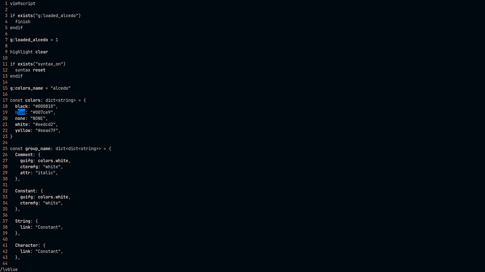

# alcedo.vim
A minimal color scheme written in Vim9 script.



## Installation
Install with your preferred plugin manager.  
Using [vim-plug](https://github.com/junegunn/vim-plug):
```vim
Plug '9yokuro/alcedo.vim'
```
Add the following line to your `vimrc`:
```vim
colorscheme alcedo
```

## Configuration
To make background transparent:
```vim
vim9script

import "alcedo.vim"

alcedo.MakeBackgroundTransparent()
```
